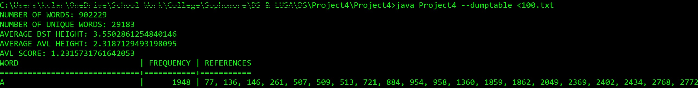
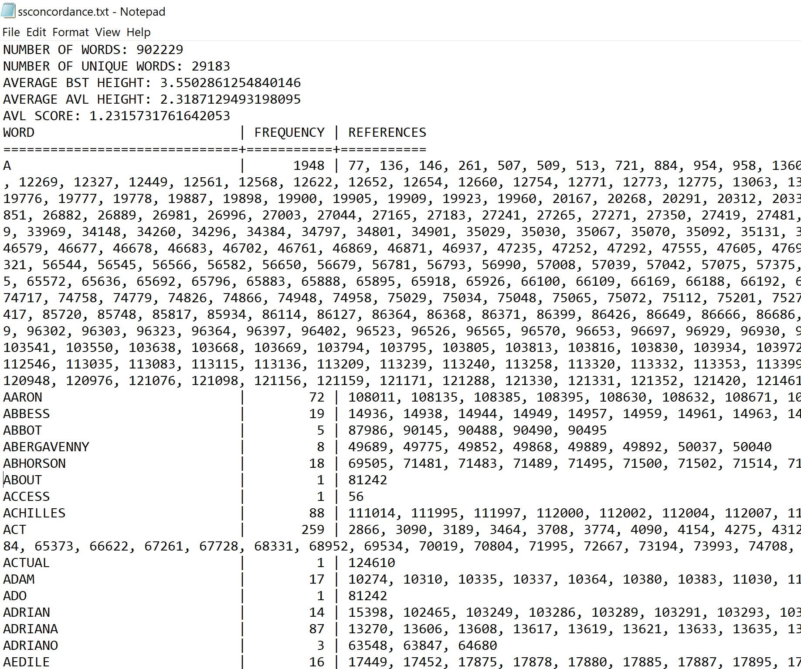
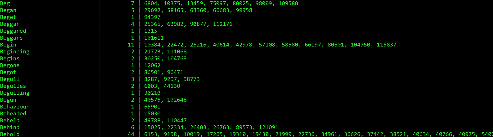

# concordance-with-trees
Concordance Tables with Binary Search Trees and AVL Trees: A Data Structures Project

<p align="center">
  
</p>

This program accepts text files and processes all the alphabet strings inside. It then dumps all of these processed strings into a concordance table that is sorted in alphabetical order (uppercase before lowercase). The concordance table is implemented as both a binary search tree and an AVL tree.



## Installation

OS X & Linux:

Download Project.zip on your local machine. Open your bash shell and navigate to the folder that contains the zip file, then type:
```sh
tar -xvf Project.zip
```
Windows:

If you already have java on your PC, and the bin directory is in your path (in most cases), you can use the command line:
```sh
jar xf test.zip
```
or if not in your path:
```sh
C:\Java\jdk1.6.0_03\bin>jar xf test.zip
```
Complete set of options for the jar tool available [here](http://download.oracle.com/javase/6/docs/technotes/tools/windows/jar.html).

## Usage example

This program computes the following of any .txt file:

* Number of Words
* Number of Unique Words (word count without repetition)
* Average Height of the Generated Binary Search Tree
* Average Height of the AVL Tree
* The AVL Score: (BST Height)-(AVL Height) / # of Unique Words

If you would like these statistics without the concordance table printed:
```sh
java Project4
```
However, if you would like the concordance table printed, add the argument --dumptable to the command:
```sh
java Project4 --dumptable
```
I like to use this program with I/O redirection on my bash shell:
```sh
java Project4 --dumptable < 100.txt > ssconcordance.txt
```


## Development setup

Ensure that you have the most recent version of Java installed on your computer. If you do not know if you have Java on your computer, click [here](https://java.com/en/download/) to visit Java's download page.

Compile the java code using the command line:

```sh
javac *.java
```
OS_X & Linux:

Run the program on your command line by typing:
```sh
java Project4
```
The program will then take standard input. Type out some fun input, then send the EOF key with a Ctrl-D for your results.

Windows:

Sorry guys, you don't have an equivalent EOF key that the cmd.exe will interpret. Reading from standard input is a bash-shell-only ability. However, that doesn't mean you are powerless - keep reading.

I/O Redirection:

Most people have no time to hand-type out information that usually goes into a concordance table. That's completely fine with this project - just use I\O redirection. The zip file that you downloaded includes a nice .txt file called 100.txt. It includes the entire works of William Shakespeare; makes for good test data. Test out the program now and type:
```sh
java Project4 < 100.txt
```
After a few seconds or so it will print out the basic data about the program. Remember the --dumptable argument if you wish to have the entire concordance table printed to standard output. If you want to have the output redirected to a file, take a look at the usage example section.



## Release History

* 0.1.0
    * The first proper release
    * CHANGE: Rename `Project4` to `concordance-with-trees`
* 0.0.1
    * Work in progress

## Meta

Kenzie Clarke – [Linkedin Page](https://www.linkedin.com/in/kenzieclarke07/) – kenzieclarke@tcu.edu

Distributed under the MIT license. See ``LICENSE`` for more information.

[https://github.com/spinystarfish/github-link](https://github.com/spinystarfish)

## Contributing

1. Fork it (<https://github.com/yourname/yourproject/fork>)
2. Create your feature branch (`git checkout -b feature/fooBar`)
3. Commit your changes (`git commit -am 'Add some fooBar'`)
4. Push to the branch (`git push origin feature/fooBar`)
5. Create a new Pull Request

<!-- Markdown link & img dfn's -->
[npm-image]: https://img.shields.io/npm/v/datadog-metrics.svg?style=flat-square
[npm-url]: https://npmjs.org/package/datadog-metrics
[npm-downloads]: https://img.shields.io/npm/dm/datadog-metrics.svg?style=flat-square
[travis-image]: https://img.shields.io/travis/dbader/node-datadog-metrics/master.svg?style=flat-square
[travis-url]: https://travis-ci.org/dbader/node-datadog-metrics
[wiki]: https://github.com/yourname/yourproject/wiki
